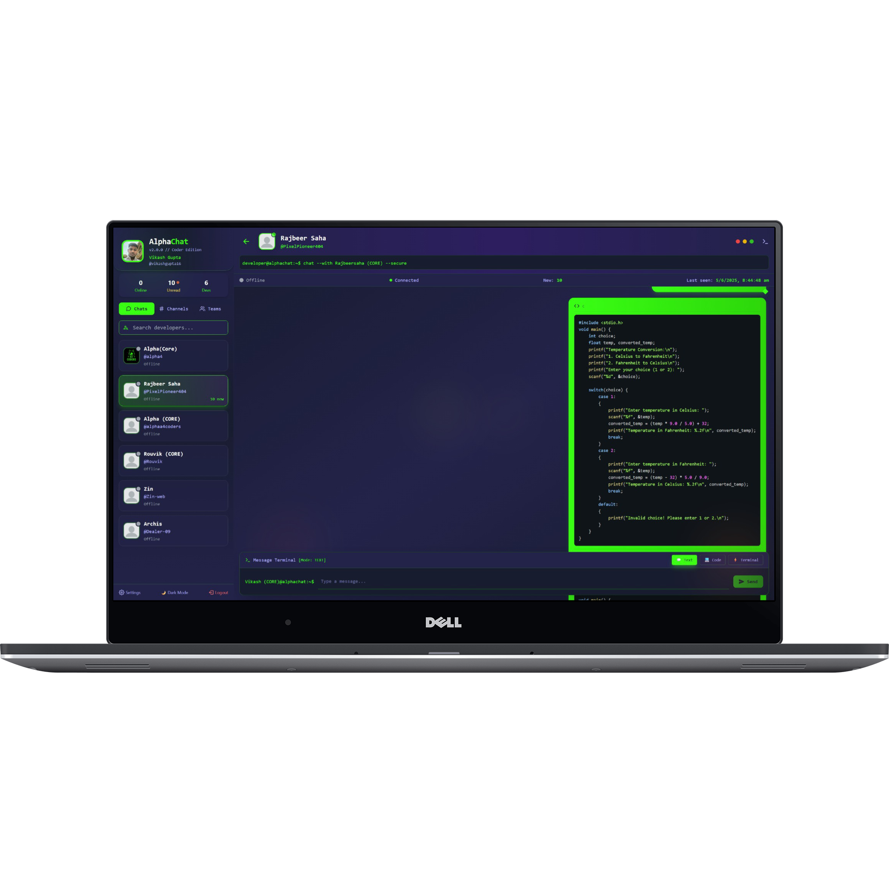
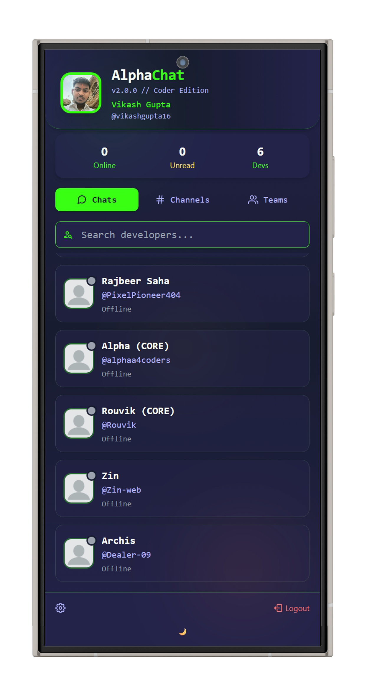
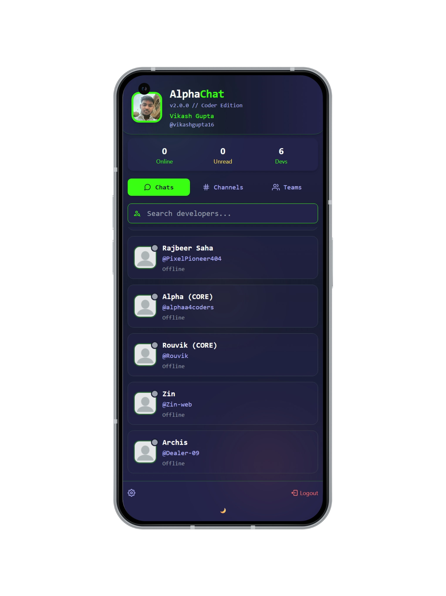

# 🚀 Alpha-Chats: Elite Developer Communication Terminal

<div align="center">



[](https://github.com/your-username/alpha-chats)
[](https://nodejs.org/)
[](https://reactjs.org/)
[](https://socket.io/)
[](./LICENSE)

**A sophisticated real-time chat application specifically designed for developers**

*Terminal-inspired design meets modern chat functionality*

</div>

---

## 📖 Table of Contents

- [🎯 Overview](#-overview)
- [✨ Features](#-features)
- [🏗️ Architecture](#️-architecture)
- [🔧 Tech Stack](#-tech-stack)
- [⚡ Quick Start](#-quick-start)
- [🚀 Deployment](#-deployment)
- [📱 Screenshots](#-screenshots)
- [🔐 Security](#-security)
- [🧪 Testing](#-testing)
- [🛠️ Development](#️-development)
- [📊 Performance](#-performance)
- [🤝 Contributing](#-contributing)
- [📄 License](#-license)

---

## 🎯 Overview

**Alpha-Chats** is an elite communication platform built exclusively for developers. Combining the familiar terminal aesthetic with modern real-time chat features, it creates an immersive coding environment perfect for development teams.

### 🌟 Why Alpha-Chats?

- **Developer-First Design**: Built specifically for coding teams with terminal-inspired UI
- **Real-Time Everything**: Instant messaging, typing indicators, and online presence
- **Code-Centric Features**: Syntax highlighting for 15+ languages and command sharing
- **Production-Ready**: Scalable architecture with comprehensive security measures
- **Modern Stack**: Latest React 19, Node.js, and Socket.IO technologies

---

## ✨ Features

### 🚀 **Core Features**
- **Real-Time Messaging** - Instant communication with Socket.IO
- **Code Syntax Highlighting** - Support for JavaScript, Python, Java, C++, and 12+ more languages
- **Terminal Command Sharing** - Special formatting for shell commands
- **File & Image Sharing** - Cloudinary integration for seamless uploads
- **Online Presence Tracking** - Live user status and activity indicators
- **Typing Indicators** - Real-time typing feedback
- **Message History** - Persistent chat storage with MongoDB

### 🎨 **User Experience**
- **Terminal Aesthetic** - Matrix-inspired green color scheme
- **Responsive Design** - Mobile-first approach with adaptive layouts
- **Theme Support** - Dark/Light mode toggle
- **Smooth Animations** - CSS transitions and loading states
- **Unread Tracking** - Message count and notification system
- **Profile Management** - Customizable user profiles with photo uploads

### 🔒 **Security & Performance**
- **JWT Authentication** - Secure token-based user sessions
- **bcrypt Password Hashing** - Industry-standard security
- **CORS Protection** - Controlled cross-origin requests
- **Input Validation** - Server-side sanitization
- **Optimized Builds** - Vite-powered frontend optimization
- **Database Indexing** - Efficient query performance

---

## 🏗️ Architecture

### **Frontend Architecture**
```
src/
├── components/           # Reusable UI components
│   ├── MessageArea.jsx        # Main chat interface
│   ├── SideBar.jsx           # User list and navigation
│   ├── ThemeContext.jsx      # Theme management
│   └── LoadingSpinner.jsx    # Loading states
├── pages/               # Route-based components
│   ├── Home.jsx             # Main chat page
│   ├── Login.jsx            # Authentication
│   ├── Profile.jsx          # User profile management
│   └── SignUp.jsx           # User registration
├── Hooks/               # Custom React hooks
│   ├── socketManager.js     # Global socket management
│   ├── useSocket.js         # Socket.IO integration
│   └── getCurrentUser.js    # User authentication
├── redux/               # State management
│   ├── store.js            # Redux store configuration
│   └── userSlice.js        # User state management
└── config/              # Configuration files
    ├── axios.js            # HTTP client setup
    └── constants.js        # App constants
```

### **Backend Architecture**
```
backend/
├── controllers/         # Business logic
│   ├── auth.controllers.js   # Authentication logic
│   ├── user.controller.js    # User management
│   └── message.controller.js # Message handling
├── models/              # Database schemas
│   ├── user.model.js         # User data structure
│   ├── message.model.js      # Message data structure
│   └── conversation.model.js # Chat conversations
├── routes/              # API endpoints
│   ├── auth.routes.js        # Authentication routes
│   ├── user.routes.js        # User management routes
│   └── message.routes.js     # Message routes
├── middlewares/         # Custom middleware
│   ├── isAuth.js            # JWT authentication
│   └── multer.js            # File upload handling
└── config/              # Configuration
    ├── db.js               # Database connection
    ├── token.js            # JWT utilities
    └── cloudinary.js       # File upload config
```

---

## 🔧 Tech Stack

### **Frontend**
- **React 19.1.0** - Modern React with latest features
- **Redux Toolkit 2.8.2** - State management
- **React Router 7.6.0** - Client-side routing
- **Socket.IO Client 4.8.1** - Real-time communication
- **Tailwind CSS 3.4.17** - Utility-first styling
- **Vite 6.3.5** - Fast build tool and dev server
- **React Syntax Highlighter** - Code highlighting

### **Backend**
- **Node.js 18+** - JavaScript runtime
- **Express 5.1.0** - Web application framework
- **Socket.IO 4.8.1** - Real-time bidirectional communication
- **MongoDB + Mongoose 8.15.0** - Database and ODM
- **JWT** - Authentication tokens
- **bcryptjs** - Password hashing
- **Cloudinary** - File storage and optimization
- **Multer** - File upload middleware

### **Development & Deployment**
- **Vite** - Development server and build tool
- **ESLint** - Code linting
- **Nodemon** - Development auto-restart
- **Concurrently** - Run multiple commands
- **Vercel** - Frontend hosting
- **Railway** - Backend hosting (recommended)

---

## ⚡ Quick Start

### **Prerequisites**
- Node.js 18+ installed
- MongoDB database (local or MongoDB Atlas)
- Cloudinary account for file uploads

### **1. Clone & Install**
```bash
git clone https://github.com/your-username/alpha-chats.git
cd alpha-chats

# Install all dependencies (root, frontend, backend)
npm run install:all
```

### **2. Environment Setup**

**Backend Environment** (`backend/.env`):
```env
MONGO_URL=mongodb://localhost:27017/alpha-chats
JWT_SECRET=your-super-secret-jwt-key
CLOUDINARY_CLOUD_NAME=your-cloudinary-name
CLOUDINARY_API_KEY=your-cloudinary-key
CLOUDINARY_API_SECRET=your-cloudinary-secret
NODE_ENV=development
PORT=4000
```

**Frontend Environment** (`frontend/.env`):
```env
VITE_API_URL=http://localhost:4000
VITE_SOCKET_URL=http://localhost:4000
```

### **3. Database Setup**
```bash
# If using local MongoDB
mongod

# Or use MongoDB Atlas cloud database
# Update MONGO_URL in backend/.env with your Atlas connection string
```

### **4. Run Development Servers**
```bash
# Start both frontend and backend simultaneously
npm run dev

# Or start individually:
npm run dev:backend    # Backend on http://localhost:4000
npm run dev:frontend   # Frontend on http://localhost:5173
```

### **5. Access the Application**
- **Frontend**: http://localhost:5173
- **Backend API**: http://localhost:4000
- **Socket.IO**: ws://localhost:4000

---

## 🚀 Deployment

### **⚠️ Important: Socket.IO Compatibility**

**Alpha-Chats uses Socket.IO for real-time features, which requires persistent connections. Vercel's serverless architecture doesn't support WebSocket connections.**

### **🥇 Recommended: Railway + Vercel**
**Best solution for full functionality**

#### **Backend Deployment (Railway)**
1. Sign up at [railway.app](https://railway.app)
2. Connect your GitHub repository
3. Set environment variables:
```env
MONGO_URL=mongodb+srv://your-atlas-connection
JWT_SECRET=your-production-secret
CLOUDINARY_CLOUD_NAME=your-cloudinary-name
CLOUDINARY_API_KEY=your-cloudinary-key
CLOUDINARY_API_SECRET=your-cloudinary-secret
NODE_ENV=production
```
4. Deploy automatically from GitHub

#### **Frontend Deployment (Vercel)**
```bash
cd frontend

# Update environment for production
echo "VITE_API_URL=https://your-app.railway.app" > .env
echo "VITE_SOCKET_URL=https://your-app.railway.app" >> .env

# Deploy to Vercel
npx vercel --prod
```

### **🥈 Alternative: Render + Vercel**
Similar setup with Render for backend hosting.

### **🥉 Limited: Vercel Only (No Real-time)**
Deploy both to Vercel but lose Socket.IO functionality.

---

## 📱 Screenshots

<div align="center">

### **Desktop Experience**


### **Mobile Responsive**


### **Clean Interface**


</div>

---

## 🔐 Security

### **Authentication & Authorization**
- **JWT Tokens** - Secure, stateless authentication
- **HTTP-Only Cookies** - Secure token storage
- **Password Hashing** - bcrypt with salt rounds
- **Session Management** - Automatic token refresh

### **Data Protection**
- **Input Validation** - Server-side validation for all inputs
- **XSS Protection** - Content sanitization
- **CORS Configuration** - Controlled cross-origin requests
- **Rate Limiting** - Protection against spam and abuse

### **File Upload Security**
- **File Type Validation** - Whitelist approach
- **Size Limits** - Prevent large file attacks
- **Cloudinary Integration** - Secure cloud storage
- **Malware Scanning** - Built-in protection

---

## 🧪 Testing

### **Test Structure**
```bash
# Backend tests
npm run test:backend

# Test user creation
npm run test:users

# Run all tests
npm run test:all
```

### **Available Test Scripts**
- **Unit Tests** - Component and function testing
- **Integration Tests** - API endpoint testing
- **Socket.IO Tests** - Real-time communication testing
- **User Flow Tests** - Complete user journey testing

---

## 🛠️ Development

### **Development Scripts**
```bash
# Development with hot reload
npm run dev

# Frontend only
npm run dev:frontend

# Backend only  
npm run dev:backend

# Build for production
npm run build

# Clean database
cd backend && npm run clean
```

### **Code Structure Guidelines**
- **Components** - Reusable UI components in `frontend/src/components/`
- **Pages** - Route-based components in `frontend/src/pages/`
- **Hooks** - Custom React hooks in `frontend/src/Hooks/`
- **Controllers** - Business logic in `backend/controllers/`
- **Models** - Database schemas in `backend/models/`

### **Coding Standards**
- **ESLint** - Consistent code formatting
- **Modern JavaScript** - ES6+ features
- **React Hooks** - Functional components
- **Error Handling** - Comprehensive error boundaries
- **TypeScript Ready** - Easy migration path

---

## 📊 Performance

### **Frontend Optimizations**
- **Code Splitting** - Lazy loading for route components
- **Image Optimization** - WebP format with fallbacks
- **Bundle Analysis** - Vite rollup optimizations
- **Caching** - Browser caching for static assets

### **Backend Optimizations**
- **Database Indexing** - Optimized queries for messages and users
- **Response Compression** - Gzip compression for API responses
- **Connection Pooling** - Efficient database connections
- **Memory Management** - Proper resource cleanup

### **Socket.IO Optimizations**
- **Global Socket Manager** - Single connection per user
- **Event Throttling** - Prevent spam
- **Connection Recovery** - Automatic reconnection
- **Scalability Ready** - Redis adapter compatible

---

## 🤝 Contributing

We welcome contributions! Please see our [Contributing Guide](./CONTRIBUTING.md) for details.

### **Development Process**
1. Fork the repository
2. Create a feature branch
3. Make your changes
4. Add tests for new features
5. Submit a pull request

### **Bug Reports**
Please use the issue tracker to report bugs or request features.

---

## 📄 License

This project is licensed under the ISC License - see the [LICENSE](./LICENSE) file for details.

---

<div align="center">

**Built with ❤️ by Vikash (Team Lead)**

[](https://github.com/your-username)

**⭐ Star this repo if you find it useful!**

</div>

---

## 🔍 API Documentation

### **Authentication Endpoints**

#### Register User
```http
POST /api/auth/signup
Content-Type: application/json

{
  "userName": "johndoe",
  "github": "johndoe_dev", 
  "password": "securePassword123"
}
```

#### Login User
```http
POST /api/auth/login
Content-Type: application/json

{
  "github": "johndoe_dev",
  "password": "securePassword123"
}
```

### **User Management**

#### Get Current User
```http
GET /api/user/current
Authorization: Bearer <jwt_token>
```

#### Update Profile
```http
PUT /api/user/profile
Content-Type: application/json
Authorization: Bearer <jwt_token>

{
  "userName": "newUsername",
  "github": "newHandle"
}
```

### **Message Endpoints**

#### Send Message
```http
POST /api/message/send/:recipientId
Content-Type: application/json
Authorization: Bearer <jwt_token>

{
  "message": "Hello, how are you?",
  "messageType": "text"
}
```

#### Get Conversation
```http
GET /api/message/get/:recipientId?page=1&limit=50
Authorization: Bearer <jwt_token>
```

---

## 🔌 Socket.IO Events

### **Client → Server Events**
```javascript
// Join user room
socket.emit('join', userId)

// Send message
socket.emit('sendMessage', {
  recipientId: 'user123',
  message: 'Hello!',
  messageType: 'text',
  sender: 'currentUserId'
})

// Typing indicators
socket.emit('typing', {
  recipientId: 'user123', 
  isTyping: true
})
```

### **Server → Client Events**
```javascript
// Receive message
socket.on('receiveMessage', (messageData) => {
  // Handle new message
})

// Online users update
socket.on('onlineUsers', (usersList) => {
  // Update online users list
})

// Typing status
socket.on('userTyping', (typingData) => {
  // Show typing indicator
})
```

---

## 🚧 Recent Updates

### ✅ **Version 2.0.0 - Major Bug fixes & Optimizations**

**🔧 Critical Issues Resolved:**
- **Socket Disconnection Fix**: Implemented global socket manager to prevent disconnections during profile updates
- **Profile Photo Upload Fix**: Fixed Content-Type handling for FormData uploads to Cloudinary
- **Profile UX Improvements**: Added "Save & Exit" functionality with smooth navigation
- **File Cleanup**: Removed redundant and test files for production readiness

**🚀 Performance Improvements:**
- **Global Socket Management**: Single connection per user with proper state management
- **Smart Content-Type Handling**: Axios interceptor only sets JSON Content-Type for non-FormData
- **Optimized Profile Flow**: Streamlined save process with visual feedback

**📋 Code Quality:**
- **Comprehensive Documentation**: Complete README with deployment guides
- **Environment Setup**: Clear development and production configurations
- **Testing Ready**: Backend tests and development scripts

### **Status: Production Ready** ✅
- All major bugs resolved
- Socket connections stable
- File uploads working
- Comprehensive documentation
- Clean codebase

---

## 🎊 What Makes Alpha-Chats Special

### **🎯 Developer-Focused**
Unlike generic chat apps, Alpha-Chats is built specifically for developers with features like:
- **Code syntax highlighting** for 15+ programming languages
- **Terminal-inspired interface** that feels familiar
- **Command sharing** with proper formatting
- **GitHub integration** for developer identity

### **⚡ Real-Time Performance**
- **Instant message delivery** with Socket.IO
- **Live typing indicators** showing user activity
- **Online presence tracking** for team awareness
- **Global socket management** for connection stability

### **🛡️ Production-Ready Security**
- **JWT authentication** with secure token handling
- **bcrypt password hashing** with proper salt rounds
- **CORS protection** with configurable origins
- **Input validation** and XSS protection

### **📱 Modern User Experience**
- **Mobile-first responsive design**
- **Smooth animations** and micro-interactions
- **Dark theme** optimized for developers
- **Intuitive navigation** and clean interface

---

*Built by developers, for developers. Join the Alpha-Chats community today!*
